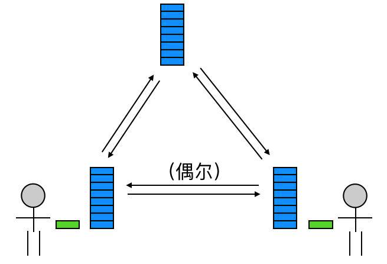

# 什么是分布式版本控制系统（DVCS）

分布式VCS（Distributed VCS / DVCS）和中央式的区别在于，分布式VCS除了中央仓库之外，还有本地仓库：团队中每一个成员的机器上都有一份本地仓库，这个仓库里包含了所有的版本历史，或者话句话说，每个人在自己的机器上就可以提交代码，查看历史，而无需联网和中央仓库交互——当然，取而代之的，你需要和本地仓库交互。

中央式VCS的中央仓库有两个主要功能：**保存版本历史**、**同步团队代码**。而在分布式VCS中，保存版本历史的工作转交到了每个团队成员的本地仓库中，中央仓库就只剩下了同步团队代码这一个主要任务。它的中央仓库依然也保存了历史版本，但这份历史版本更多的是作为团队间的同步中转站。

## 工作模型

依然以三人团队为例，分布式VCS的工作模型大致是这样：

1. 首先，你作为主工程师，独立搭建了项目架构，**并把这些代码提交到了本地仓库**；
2. 然后，你在服务器上创建了一个中央仓库，并把1中的提交从**本地仓库推送到了服务器的中央仓库**;
3. 其他同事**把中央仓库的所有内容克隆到本地，拥有各自的本地仓库**，从此刻开始，你们三人并行开发；
4. 在之后的开发过程中，你们三人总是每人独立负责开发一个功能，在这个功能开发过程中，**一个人会把它的每一步改动提交到本地仓库**。注意：由于本地提交无需立即上传到中央仓库，所以每一步提交不必是一个完整功能，而可以是功能中的一个步骤或块。
5. 在一个人把某功能开发完成之后，他就可以把这个功能相关的所有提交**从本地仓库推送到中央仓库**；
6. 每次当有人把新的提交推送到中央仓库时，另外两个人就可以选择**把这些提交同步到自己的机器上，并把它们和自己的本地代码合并**；

可以看出，这个工作模型和上一节讲的「中央式VCS的工作模型」很相似，只是把代码的提交和上传过程拆开了。

另外，和上节讲的中央式VCS工作模型一样，这个也只是分布式VCS的一个最基本的工作模型，实际的开发工作会比这个麻烦和复杂。但这是个核心模型，你把它理解了，就可以更好地看懂后面的内容。

## 优点和缺点

分布式VCS的优点：

1. 大多数的操作可以在本地进行，所以速度更快，而且由于无需联网，所以即使不在公司甚至没有在联网，你也可以提交代码、查看历史，从而极大地减小了开发者的网络条件和物理位置限制（例如，你在飞机上提交代码、切换分支等等）；
2. 由于可以提交到本地，所以你可以分步提交代码，把代码提交做的更细，而不是一个提交包含很多代码，难以review也难以回溯。

分布式VCS的缺点：

1. 由于每一个机器都与完整的本地仓库，所以初次获取项目（Git术语：clone）的时候会比较耗时；
2. 由于每个机器都有完整的本地仓库，所以本地占用的存储比中央式VCS更高

>对于一般的程序项目而言，由于项目的大多数内容都是文本形式的代码，所以工程的体积都并不是很大，再加上文本内容自身的特点，VCS可以利用算法来把仓库的体积极大的压缩。这就导致，在实际中，Git等分布式VCS的仓库体积并不大，初次获取项目的耗时很本地仓库的存储占用都很小。所以对于大多数的程序项目而言，分布式VCS「尺寸大，初次下载慢」的问题其实并不严重。
>
>不过也有一些例外，比如游戏开发。游戏的开发中有大量的大尺寸数据和媒体文件，并且这些文件的格式也不容易压缩尺寸，如果用分布式VCS会导致仓库的体积非常庞大。所以一些大型游戏的开发会选择中央式的VCS来管理代码。