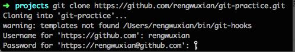

# 上手1：新公司用Git管理代码，怎么快速上手？

>已经有Git经验的可以跳过这一节

刚进入新公司，被告知团队是用Git管理项目代码的，而你却从来没用过Git。纵然同事告诉你「没事，先自学一下」「有问题可以问我」，但你肯定不想一进公司就花太多时间在自学上，也不想过多的打扰这些刚认识的同事。怎么办？


对你来说，最重要的是，**先知道Git怎么用**。先把最基本的掌握了，至于正规团队使用Git有什么额外要求、Git有什么高级用法、Git的原理这些，都可以放在这之后。万事开头难，你先把Git最基本的使用掌握了，后面的再一步一步来。


## 安装Git

点击[这里](https://git-scm.com/)去下载个Git，安装到你的机器上。或者如果你喜欢用Homebrew或apt什么的来安装都好，总之，把它安装好。


装好之后，就可以正式开始上手Git了。


## 先建个练习项目

学习的时候最好别拿团队的正式项目练手，先在GitHub上建一个自己的练习项目。


1. 访问[GitHub](https://github.com/)(或者别的平台比如Bitbucket什么的也行)
2. 注册或登录您的账号
3. 点击右上角的「New Repository」来新建远程仓库


4. 进入仓库设置页面填写信息：其中 ① 是你的仓库名，这个仓库名同样会被GitHub设置为你的仓库的根目录的名称；②是为`.gitignore`设置项目类型，`.gitignore`是Git仓库中的一个特殊的文本文件，它里面记录了你不希望提交到仓库的目录和文件的名称或类型，例如你的`/build`目录；把 ①和②填好之后，就可以点 ③来完成远程仓库的创建了。


创建玩的远程仓库大概长这样：


点击右边的「Clone or download」，然后把仓库的`clone`地址复制到剪贴板：


>clone地址是什么？下面马上就说了！

## 把远程仓库取到本地

接下来就可以把远程仓库取下来了。取得方式很简单：在Terminal或者cmd中切换到你希望放置项目的目录中，然后输入：

```shell
git clone 你刚刚复制的地址
```

Git就会把你的远程仓库clone到本地。在这个过程中，你可能需要输入你的GitHub用户名和密码：



输入正确的用户名和密码之后，你会看到你的当前目录下多了一个新的子目录，它的名字和刚才新建的GitHub仓库名一致：


进入这个目录，你会发现这里除了你刚才添加的`LICENSE`和`.gitignore`文件外，还有一个叫做`.git`的隐藏目录。


这个`.git`目录，就是你的**本地仓库（Local Repository）**,你的所有版本信息都会存在这里。而`.git`所在的这个根目录，称为Git的**工作目录（Working Directory）**，它保存了你当前从从库中签出（checkout）的内容。现在你在项目的目录下输入：

```shell
git log
```


在这里你只能看到一个提交，这个提交是GitHub帮你做的，它的内容是创建你的初始`.gitignore`和`LICENSE`这两个文件。图一第一行中的`commit`右边的那一大串字符（09773235...21411），是这个`commit`的SHA-1校验和（如果不知道什么是SHA-1，你可以暂时把它简单理解为这个`commit`的ID）；后面括号里的内容（HEAD -> master…）稍后再讲；第一行的下面，依次是这个`commit`的作者、提交日期和提交信息，其中提交信息记录了这个提交做了什么，是提交者填写的（当然，这条提交信息是GitHub帮你写的）。

